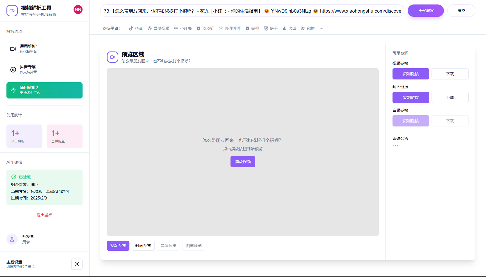

# 视频解析工具

一个强大的视频解析和下载工具，支持多个主流平台。


## 预览

<div align="center">
  
  
  
  
</div>

<div align="center">
  
  
  
  
</div>

## 功能特点

- 🚀 支持多个主流平台视频解析
- 💾 支持视频、音频、封面下载
- 🖼️ 支持图集解析和下载
- 🌓 深色/浅色主题切换
- 📱 完美支持移动端
- 📊 数据统计功能
- ⚙️ 系统设置功能

## 支持平台

- 抖音
- 西瓜视频
- 小红书
- 皮皮虾
- 哔哩哔哩
- 微视
- 快手
- 火山
- 微博
- 支持全平台...

## 部署方式
 1.**Node.js不得低于20版本**
 2.**Redis必须安装**
 3.**MySQL必须安装**

### 本地开发（把env.example文件名改成.env）.env里面的配置必须配置
1. **安装依赖**:
   
   ```bash
   npm install
   ```
   
2. **启动开发服务器**：

   ```bash
   npm run dev
   ```

### 服务器部署（把env.example文件名改成.env）.env里面的配置必须配置

1. **下载安装包**：
 **然后运行这个命令**：
   
   ```bash
   ./deploy.sh
   ```
   然后运行：http://你的服务器ip:3010，即可访问项目，再接着下面的步骤导入数据库，如果不导入数据库，项目无法注册登录
   ### Admin Key/管理员密钥/作用：导入数据表和初始化数据表
   ADMIN_KEY=123456  # 替换为你的实际密钥/随意设置 
   ### http://localhost:3000/api/cleanup?key=123456 本地开发清除数据库
   ### http://localhost:3000/api/init?key=123456 本地开发初始化数据库（先执行后面带这个/api/cleanup?key=123456再执行后面带这个/api/init?key=123456）按照顺序
   ### 如果是部署到服务器，项目启动成功后请先使用 http://你的服务器ip:3010/api/cleanup?key=123456 访问网址再继续访问 http://你的服务器ip:3010/api/init?key=123456 来清除和初始化数据库
   **如果访问不了，请检查防火墙是否放行3010端口**
   如果需要域名访问，请自行请教别人或者联系QQ362856178，反向代理不会的找我

3. **以后每修改一次代码就运行这个命令，切记：./deploy.sh**
   

4. **如果你希望在服务器重启后自动启动你的 Next.js 应用，可以使用 PM2 的自启动功能**：

   ```bash
   pm2 startup
   pm2 save
   ```

## 技术栈

- Next.js
- React
- TypeScript
- Tailwind CSS
- Shadcn/ui

## 开发者

- 开发者：灵梦
- 联系方式：[QQ：362856178]

## 许可证

本项目基于 MIT 许可证开源，详见 [LICENSE](LICENSE) 文件。

## 更新日志

### v1.0.1 (2025-01-04)
- 🔧 优化图片解析功能
- 🐛 修复图片内容显示问题
- ✨ 添加公告管理功能
- 💄 优化移动端界面样式
- 🚀 提升解析成功率
- 👥 用户管理系统
- 🔑 API 密钥管理
- 📊 数据统计功能
- ⚙️ 系统设置功能

### v1.0.0 (2024-01-01)
- 🎉 首次发布
- ✨ 支持多平台视频解析
- 🎨 支持深色模式
- 📱 支持移动端


## 贡献

欢迎提交 Issue 和 Pull Request！

## 免责声明

本工具仅供学习交流使用，请勿用于商业用途。使用本工具时请遵守相关法律法规，尊重版权。
